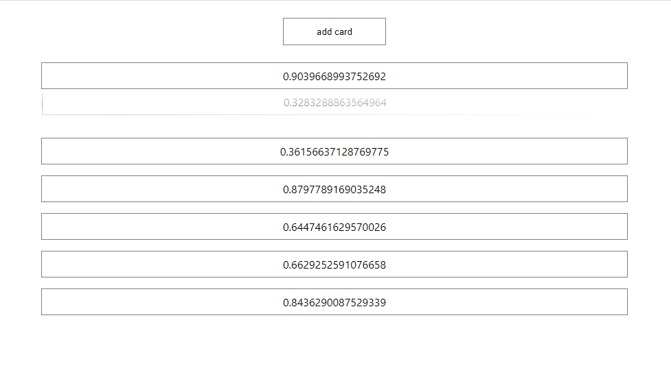

## О проекте:  

Проект представляет собой демонстрацию работы  drag-n-drop in React.  

## В проекте использованы следующие технологии:  

JS  

React.js(React hooks)  

react-dnd  

## Для запуска проекта выполнить следующие команды:  

Для клонирование репозитория: git clone https://github.com/ortkyu/dndReactTest.git  

Инициализация проекты:  

npm install 
или 
yarn install  

Запуск проекта:  

npm start 
или 
yarn start  

Приложение запускается на http://localhost:3000  

В браузере переходим по адресу:  http://localhost:3000  

